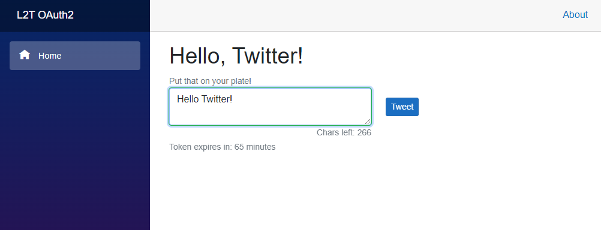

### Kestrel Hosted Blazor WASM / [LINQ To Twitter](https://github.com/JoeMayo/LinqToTwitter) OAuth2 Sample ###

[Joe Mayo](https://github.com/JoeMayo)'s Linq To Twitter [OAuth2 blog post](https://joemayo.medium.com/using-oauth-2-0-with-linq-to-twitter-eac6d9035084)

For this sample to work you'll need to add the file `/Server/twitterkeys.ini` which is called in `/Server/Program.cs` *(line 5-13)* and sets the `TwitterClientID` & `TwitterClientSecret` enviroment variables.

    TwitterClientID="Your Twitter Client ID"
    TwitterClientSecret="Your Twitter Client Secret"

You can obtain your Twitter OAuth2 Client ID & Client Secret at [developer.twitter.com](https://developer.twitter.com/)

Also at [developer.twitter.com](https://developer.twitter.com/) set your 'User authentication settings' to:

 * Enable 'OAuth2'
 * Type of App: 'Web App'
 * Twitter Callback URI / Redirect URL: `https://127.0.0.1/OAuth2/Complete`

**Notable files:**

  * Client:
    * [Client/Pages/Index.razor](LINQ_To_Twitter_OAuth2_Sample/Client/Pages/Index.razor)
    * [Client/Pages/Callback.razor](LINQ_To_Twitter_OAuth2_Sample/Client/Pages/Callback.razor)

  * Server:
    * [Server/Program.cs](LINQ_To_Twitter_OAuth2_Sample/Server/Program.cs)
    * [Server/Controllers/OAuth2Controller.cs](LINQ_To_Twitter_OAuth2_Sample/Server/Controllers/OAuth2Controller.cs)

**Joe Mayo's LINQ to Twitter ASP.NET 6 OAuth2 GitHub Examples:**

 * [MVC](https://github.com/JoeMayo/LinqToTwitter/tree/main/Samples/LinqToTwitter6/ASP.NET/LinqToTwitter.MVC.CSharp)
 * [Console](https://github.com/JoeMayo/LinqToTwitter/tree/main/Samples/LinqToTwitter6/Console/ConsoleDemo.CSharp)
